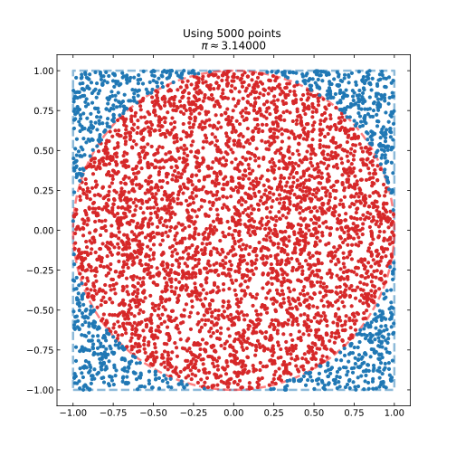

# Monte Carlo Pi
A comparison of estimating PI with various languages (Python and C++ for now).

The routine itself is very simple - it compares the area of a circle and square by generating random cooridnates (x,y) and checking if they are within the radius of the circle or not.

If the total number of points generated (representing the area of the square) is compared to the number of points in the circle (representing the area of the circle), a value of Pi can be estimated through the relation:
```
PI = 4 * circle_points / total_points
```


The estimation of Pi becomes better with increasing iterations - which becomes ocmputationally more expensive. For now, I have included four variants here: A Python routine, a Python rountine using multiprocessing.pool with 4 workers, a C++ routine and a C routine. A comparison between a number of runs with increasing iteration count can be seen below:


